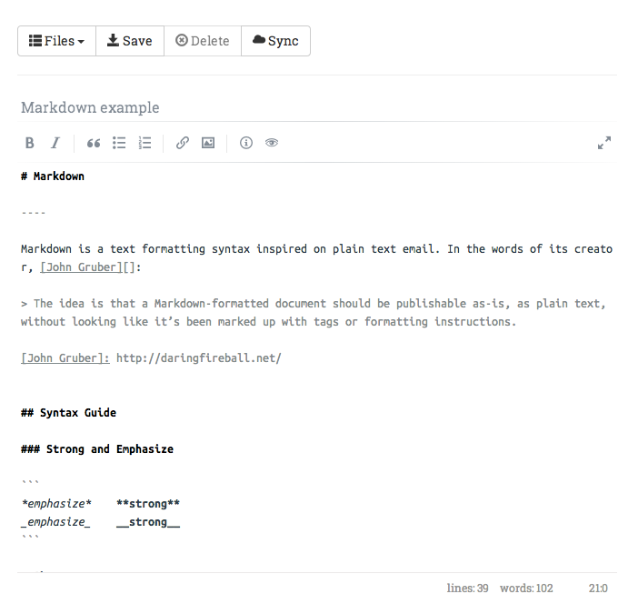

# Redislax - Relax with Redis support

A new strange experiment. Clutter-less markdown-enabled text editor, able to save files on a Redis database.

## Requirements

* Access to a Redis database,
* Ability to run a Python WSGI server for the Flask app,

### Install the Python packages

Inside a virtualenv (preferrably):

```
pip install -r requirements.txt
```

### Configuration

By default, the application will try to connect on the following database.

```python
REDIS_HOST = 'localhost'
REDIS_PORT = 6379
REDIS_DB = 0
```

To override this default values, create a ``local_settings.py`` file and change these parameters to fit your needs.


## Run

Run the following command:

```
python app.py
```

and go to the following URL with your browser: ``http://localhost:5000/``.

### Serve to the world

If you want to expose this application on the network, you'll have to set your host parameter as follows:

```python
HOST = '0.0.0.0'
```

To run the application with this setup, you'll have to do it as root:

```
sudo /home/user/.virtualenvs/MYVIRTUALENV/bin/python app.py
```

Of course, you can change the port if you need it.

## Screen capture



## Colophon

* [Flask](http://flask.pocoo.org/), [Flask-restful](https://github.com/twilio/flask-restful) and [Flask-And-Redis](https://github.com/playpauseandstop/Flask-And-Redis)
* [Editor.js](https://github.com/lepture/editor),
  by Hsiaoming Yang.
* [Glyphicons icons](http://glyphicons.com/),
* [JQuery](http://jquery.com),
* Fonts are [Ubuntu Mono](http://font.ubuntu.com/),
  [Roboto Slab](http://www.google.com/fonts/specimen/Roboto+Slab), provided by
  [Google Webfonts](https://www.google.com/fonts/)
* Responsive grid by the [Twitter Bootstrap](http://getbootstrap.com/)


## License

This code is published under the terms of the [WTFPL](http://www.wtfpl.net/).
